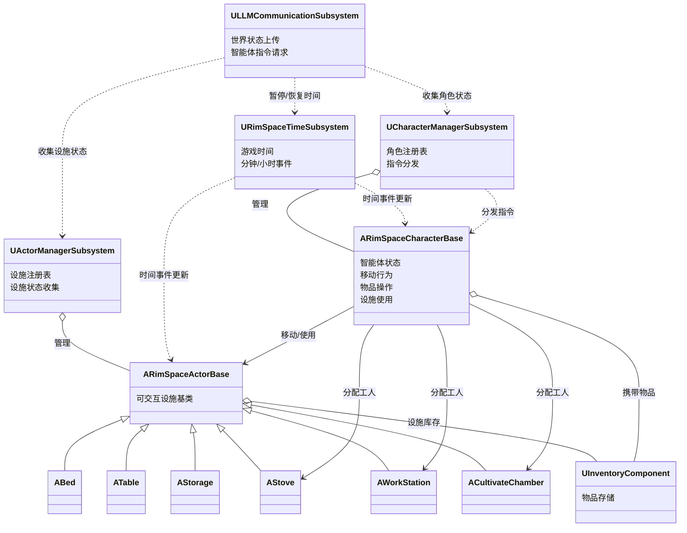
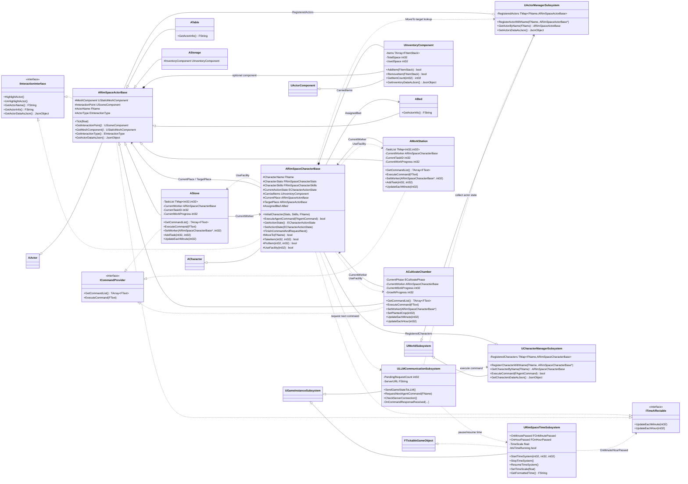
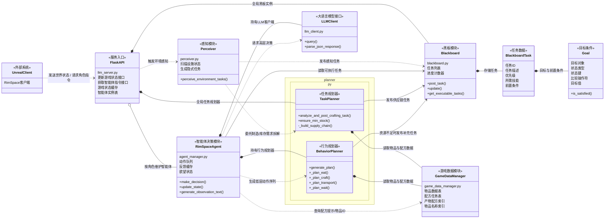
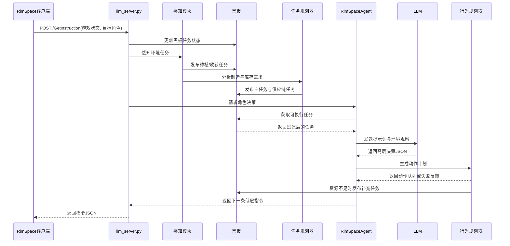

# RimSpace Actor / Subsystem / Character Class Diagram

## Thesis Version

## Detailed Version

## Notes

- `ARimSpaceActorBase` is the common base for placeable interactive actors. It registers itself in `UActorManagerSubsystem` during `BeginPlay` and subscribes to `URimSpaceTimeSubsystem` minute/hour events.
- `ARimSpaceCharacterBase` registers itself in `UCharacterManagerSubsystem`, also subscribes to time events, and uses `UActorManagerSubsystem` to resolve movement targets by name.
- `AStove`, `AWorkStation`, and `ACultivateChamber` are the main worker-driven facilities. They keep a `CurrentWorker` reference and advance work from time updates.
- `ULLMCommunicationSubsystem` gathers time, actor, and character state, pauses/resumes game time while waiting for LLM responses, and sends returned `FAgentCommand` objects into `UCharacterManagerSubsystem`.

## LLMServer 模块关系图

## LLMServer 运行时序图

