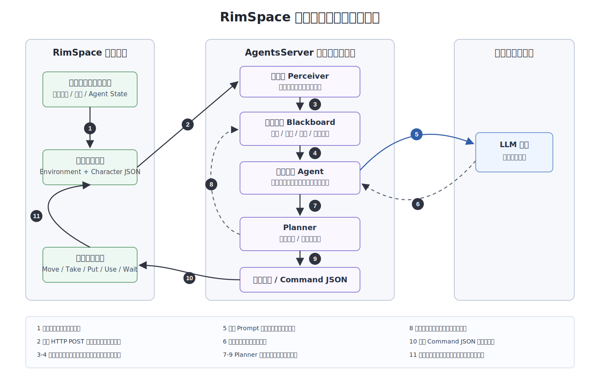
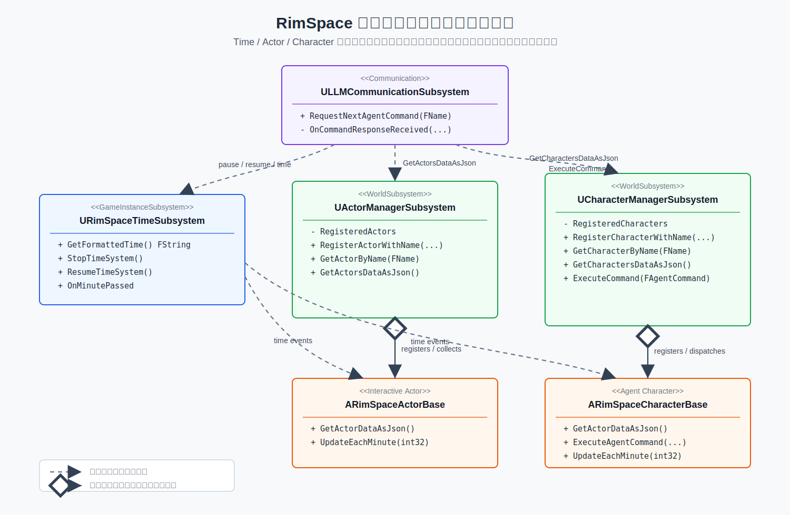
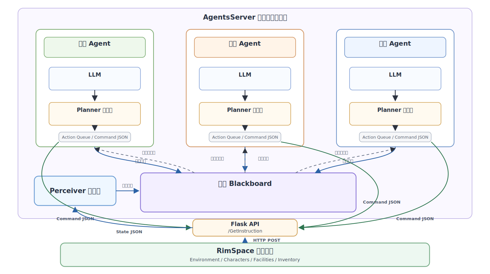

# 第六节 RimSpace 与多智能体系统的交互实现

前文已经对多智能体系统的任务分配、黑板机制和角色决策过程进行了说明，因此本节不再重复展开服务端内部结构，而是重点介绍 RimSpace 游戏环境如何与该系统连接。具体而言，本节关注三个问题：RimSpace 如何收集并发送游戏状态，多智能体服务端返回的结果如何表示，以及这些结果如何在游戏中转化为角色的实际行为。

在整体设计中，RimSpace 客户端负责维护真实的游戏世界，包括设施状态、角色状态、库存变化和时间推进；多智能体服务端负责根据这些状态生成下一步行为建议。二者通过 HTTP 接口连接，形成“状态采集、请求决策、返回指令、执行动作、更新状态”的闭环。

## 6.1 RimSpace 的状态管理子系统

RimSpace 与多智能体服务端之间的交互以角色请求下一步指令为核心触发点。当游戏中的某个角色当前动作完成后，RimSpace 会使用 `ULLMCommunicationSubsystem` 请求该角色的下一条指令。在请求过程中，系统会收集当前游戏时间、环境中所有可交互设施的状态、所有角色的状态，并将其组织为 JSON 数据发送给 AgentsServer。服务端接收到请求后，根据前文所述的多智能体机制生成一条结构化动作命令。RimSpace 客户端收到命令后，会将 JSON 解析为 `FAgentCommand` 结构体，并通过角色管理子系统找到对应角色实例，执行具体动作。动作执行完成后，角色再次请求下一条指令，由此形成持续闭环。

这种交互方式使游戏环境和多智能体系统保持相对独立。RimSpace 不需要理解服务端内部的任务分解和推理过程，只需要接收结构化指令；AgentsServer 也不直接修改游戏状态，而是通过游戏提供的动作接口间接影响环境。大致流程如图 6-1 所示。



图 6-1 多智能体框架决策流程图  
Figure 6-1 Multi-Agent Framework Decision-Making Workflow

为了使多智能体系统能够理解当前局势，RimSpace 会将游戏世界中的关键信息结构化为 JSON 数据。该数据主要包括两类：一类是环境对象状态，另一类是角色状态。这两类信息共同构成服务端进行决策时所需的最小世界模型。环境对象状态主要来自游戏中的可交互设施，例如 `Storage`、`Stove`、`WorkStation` 和 `CultivateChamber`。不同设施包含不同的状态字段。例如，仓库和工作站需要提供库存信息，炉灶和工作站需要提供玩家发布的任务队列，培养舱需要提供当前生长阶段、作物类型和生长进度。角色状态则包含角色名称、当前位置、生理状态、技能信息以及搬运的物品。具体的 JSON 示例见附录 A。

上述状态采集不是由通信模块直接遍历整个场景完成的，而是建立在 RimSpace 内部的状态管理子系统之上。RimSpace 与多智能体系统交互的基础，是游戏侧能够稳定地提供当前世界状态。为此，RimSpace 在游戏内部将时间、设施和角色分别交给三个子系统管理：`URimSpaceTimeSubsystem` 负责游戏时间推进，`UActorManagerSubsystem` 负责可交互设施注册与查询，`UCharacterManagerSubsystem` 负责角色注册与指令分发。这三个子系统共同构成 RimSpace 向外部决策模块暴露状态的基础。

`URimSpaceTimeSubsystem` 维护游戏内时间，并向设施和角色广播分钟、小时级别的时间事件。设施的生产进度、培养舱的作物生长、角色的饥饿值与体力消耗都依赖时间系统推进。由于多智能体决策请求是异步的，通信模块在等待服务端响应时也需要通过时间子系统暂停和恢复游戏时间，以避免服务端基于旧状态生成指令。

`UActorManagerSubsystem` 维护场景中所有可交互设施的注册表。仓库、炉灶、工作站、培养舱、餐桌和床等对象在游戏开始时注册到该子系统中。通信模块请求环境状态时，不需要直接遍历场景对象，而是通过 `UActorManagerSubsystem` 聚合所有已注册设施的状态。每个设施通过 `GetActorDataAsJson` 提供自身状态，例如设施名称、设施类型、库存、生产队列或培养舱生长信息。

`UCharacterManagerSubsystem` 维护角色注册表，并负责将服务端返回的指令分发给具体角色。Farmer、Chef 和 Crafter 等角色在游戏开始时注册到该子系统中。通信模块收集角色状态时，通过该子系统获得所有角色的 JSON 描述；服务端返回指令后，也由该子系统根据 `CharacterName` 查找对应角色，并调用角色的执行函数。角色自身同样通过 `GetActorDataAsJson` 提供状态，包括当前位置、行动状态、随身库存、生理属性和技能信息。

这三个子系统的关系如图 6-2 所示：



图 6-2 RimSpace 状态管理与多智能体通信类图  
Figure 6-2 RimSpace State Management and Multi-Agent Communication Class Diagram

从交互角度看，RimSpace 并不会将完整游戏对象直接暴露给服务端，而是通过上述接口提供面向决策的抽象状态。设施侧回答“世界中有哪些可交互地点、这些地点有什么物品或任务”；角色侧回答“每个角色在哪里、能做什么、当前状态如何”；时间子系统则提供当前时间以及暂停、恢复机制。这样，多智能体系统获得的是稳定、可解释的世界状态，而不是完整的 Unreal 对象结构。

这种设计保证了游戏状态仍由 RimSpace 自身维护。服务端只能根据 JSON 状态生成动作建议，不能绕过游戏规则直接修改库存、位置或生产进度。后续如果增加新的设施类型，也只需要让该设施实现或扩展自己的状态导出逻辑，再由 `UActorManagerSubsystem` 统一聚合即可。

## 6.2 AgentsServer 多智能体服务端实现

AgentsServer 是 RimSpace 外部的多智能体决策服务端，负责接收游戏环境上传的状态，并为指定角色生成下一条可执行指令。它以 HTTP 服务的形式运行，核心接口为 `/GetInstruction`。RimSpace 每次请求角色下一步行为时，都会将当前 `GameTime`、`Environment` 和 `Characters` 等状态发送至该接口；AgentsServer 则根据目标角色、当前环境和服务端维护的任务状态，返回一条结构化的 `Command JSON`。

从实现结构上看，AgentsServer 主要由接口层、感知层、黑板任务池、角色智能体、规划器和大语言模型调用模块组成。接口层负责接收 RimSpace 请求并返回指令；感知层负责扫描当前环境状态，将游戏中的隐含需求转化为任务；黑板任务池负责保存和更新共享任务；角色智能体负责根据自身角色与可见任务进行决策；规划器负责将高层意图转换为底层动作序列；大语言模型调用模块负责生成角色层面的高层行为选择。

在智能体划分上，AgentsServer 与 RimSpace 中的主要角色一一对应，维护 Farmer、Chef 和 Crafter 三类角色智能体。Farmer 智能体对应农业生产角色，主要负责种植、收获以及原材料获取相关任务；Chef 智能体对应烹饪角色，主要负责 `Stove` 中的食物制作任务；Crafter 智能体对应制造角色，主要负责 `WorkStation` 中棉线、布料和衣服等加工任务。三类智能体共享同一份游戏状态和黑板任务池，但在任务选择时会根据角色技能进行过滤，使不具备相应能力的角色不会执行错误任务。

三类角色智能体的整体框架如图 6-3 所示。每个 Agent 内部均由 LLM 与 Planner 两部分组成：LLM 负责结合角色状态、黑板任务和环境反馈生成高层意图，Planner 则负责将该意图转换为游戏环境可执行的原子动作序列。RimSpace 通过 Flask API 的 `/GetInstruction` 接口上传状态并接收动作指令；Perceiver 根据上传的环境状态识别任务需求并更新 Blackboard，三个 Agent 则通过共享黑板间接协作。



图 6-3 三角色多智能体系统总体架构  
Figure 6-3 Three-Agent Multi-Agent System Architecture

当 AgentsServer 接收到一次 `/GetInstruction` 请求时，首先会解析请求中的目标角色名称和游戏状态。随后，服务端会根据最新环境状态更新黑板任务，例如培养舱是否需要种植或收获，工作站和炉灶中是否存在制作队列，库存是否满足某个生产任务的原料需求。对于需要多个步骤完成的任务，规划器会根据配方关系和当前库存情况生成必要的生产或搬运任务，并写入黑板。

完成任务更新后，服务端会找到与 `TargetAgent` 对应的角色智能体。该智能体会读取自身状态、角色设定和当前可执行的黑板任务，并将这些信息组织为大语言模型可以理解的上下文。大语言模型负责输出高层意图，例如收获作物、搬运玉米、制作套餐或制作布料。随后，Planner 根据该高层意图、角色当前位置和环境状态生成底层动作序列，例如 `Move`、`Take`、`Put`、`Use` 或 `Wait`。服务端每次只将动作序列中的下一条指令返回给 RimSpace，剩余动作则保存在对应智能体的动作队列中，等待后续请求继续执行。

为了更直观地说明服务端中角色智能体的实现方式，可以将其核心逻辑抽象为算法 6-1 所示的流程。该流程以 `RimSpaceAgent.make_decision` 为主体，同时补充 `/GetInstruction` 接口在调用智能体前完成的状态解析、黑板更新和智能体获取过程。算法省略了 Flask 框架、日志写入和异常处理等辅助细节，只保留一次指令请求中的主要决策逻辑。

**Algorithm: AgentDecisionLoop (智能体决策执行主循环)**

Input: request data `request`, blackboard task pool `Blackboard`, global planner `Planner`

Output: next structured action command `Command JSON`

1: `targetAgentName <- request.TargetAgent`  
2: `charactersData <- request.Characters.Characters`  
3: `environmentData <- request.Environment`  
4: `charData <- FindCharacter(charactersData, targetAgentName)`  
5: `Blackboard.update(request)`  
6: `perceive_environment_tasks(environmentData, Blackboard, Planner)`  
7: `agent <- GetOrCreateAgent(targetAgentName, Blackboard)`  
8:  
9: `agent.update_state(charData, environmentData)`  
10:  
11: `if agent.action_queue is not empty then`  
12: &nbsp;&nbsp;&nbsp;&nbsp;`nextCmd <- agent.action_queue.PopFront()`  
13: &nbsp;&nbsp;&nbsp;&nbsp;`nextCmd.CharacterName <- agent.name`  
14: &nbsp;&nbsp;&nbsp;&nbsp;`nextCmd.Decision <- GetOrDefault(nextCmd.Decision, agent.last_decision_context)`  
15: &nbsp;&nbsp;&nbsp;&nbsp;`nextCmd.RemainingSteps <- Length(agent.action_queue)`  
16: &nbsp;&nbsp;&nbsp;&nbsp;`return nextCmd`  
17: `end if`  
18:  
19: `specificProfile <- agent.load_profile(agent.profession)`  
20: `worldStateText <- agent.generate_world_state(environmentData)`  
21: `systemPrompt <- BuildSystemPrompt(agent.profession, agent.name, specificProfile, worldStateText)`  
22: `userContext <- agent.generate_observation_text(charData, environmentData)`  
23: `responseText <- agent.llm.query(systemPrompt, userContext)`  
24: `decisionJson <- agent.llm.parse_json_response(responseText)`  
25: `commandType <- GetOrDefault(decisionJson.command, "Wait")`  
26: `decisionJson.current_location <- charData.CurrentLocation`  
27:  
31:  
32: `planResult <- agent.planner.generate_plan(agent.name, commandType, decisionJson, environmentData)`  
33:  
34: `if planResult.success then`  
35: &nbsp;&nbsp;&nbsp;&nbsp;`agent.action_queue <- planResult.plan`  
36: &nbsp;&nbsp;&nbsp;&nbsp;`agent.last_decision_context <- decisionJson`  
37: &nbsp;&nbsp;&nbsp;&nbsp;`firstCmd <- agent.action_queue.PopFront()`  
38: &nbsp;&nbsp;&nbsp;&nbsp;`firstCmd.CharacterName <- agent.name`  
39: &nbsp;&nbsp;&nbsp;&nbsp;`firstCmd.Decision <- decisionJson`  
40: &nbsp;&nbsp;&nbsp;&nbsp;`firstCmd.RemainingSteps <- Length(agent.action_queue)`  
41: &nbsp;&nbsp;&nbsp;&nbsp;`return firstCmd`  
42: `else`  
43: &nbsp;&nbsp;&nbsp;&nbsp;`agent.feedback_buffer <- BuildPlannerFeedback(commandType, planResult.feedback)`  
44: &nbsp;&nbsp;&nbsp;&nbsp;`return BuildWaitCommand(agent.name, decisionJson)`  
45: `end if`

其中，`RimSpaceAgent` 表示 Farmer、Chef 和 Crafter 等具体角色智能体的共同实现。不同角色的差异主要体现在角色名称、职业参数、角色技能和职业背景文件中：角色技能用于从黑板任务池中过滤可执行任务，职业背景文件和系统提示词则用于约束大语言模型生成的高层行为选择。例如 Farmer 的技能集合包含种植和收获能力，因此能够选择培养舱相关任务；Chef 的技能集合包含烹饪能力，因此优先处理 `Stove` 中的制作队列；Crafter 的技能集合包含制造能力，因此会关注 `WorkStation` 中的加工任务。

上述流程中还包含一个重要的动作队列机制。当某个高层意图被 Planner 转换为多个底层动作后，服务端不会一次性把所有动作发送给 RimSpace，而是只返回第一条动作。剩余动作保存在该角色智能体的 `action_queue` 中。下一次 RimSpace 请求同一角色的指令时，智能体会优先弹出并返回队列中的下一条动作，同时补充 `CharacterName`、`Decision` 和 `RemainingSteps` 等字段。只有当动作队列为空时，智能体才会重新构造 Prompt、调用大语言模型，并让 Planner 生成新的动作序列。这样既能保证角色行为具有连续性，也能减少每一步都重新调用大语言模型带来的不稳定性和额外开销。

因此，AgentsServer 在整体系统中承担的是“状态解释与行为生成”的角色。它并不直接修改 RimSpace 的游戏状态，而是将游戏状态转化为任务、意图和动作指令。真正的位置移动、库存变化和设施生产仍由 RimSpace 执行。这样的划分使服务端可以专注于多智能体协作决策，而游戏端则保持对世界状态的最终控制权。

## 6.3 RimSpace 与多智能体系统的执行闭环

为了说明 RimSpace 与多智能体框架集成后的实际运行方式，本节以“制作 1 份套餐与 1 件衣服”为例进行说明。该目标在玩家侧只表现为两个制作任务，但在游戏规则中会涉及作物种植与收获、原料搬运、烹饪加工和手工制造等多个环节，因此能够体现游戏环境与多智能体系统之间的协同关系。

运行开始后，玩家通过 UI 在 `Stove` 中发布套餐制作任务，或在 `WorkStation` 中发布衣服制作任务。随后，当角色请求下一步指令时，RimSpace 会将设施库存、生产队列、角色位置、角色技能和携带物品等信息封装为状态快照发送至 AgentsServer。服务端根据该状态更新黑板任务池，将玩家在游戏中发布的制作目标转化为可被多智能体框架管理的任务状态。

在任务执行过程中，不同角色根据自身能力承担不同环节。Farmer 负责玉米和棉花等原材料的种植与收获；空闲角色可以参与原料搬运，将玉米送至 `Stove` 或将棉花送至 `WorkStation`；当材料条件满足后，Chef 执行套餐制作，Crafter 则继续完成棉线、布料和衣服的加工。对于 RimSpace 来说，这些行为最终都会落实为 `Move`、`Take`、`Put`、`Use` 等原子指令，并由游戏侧按照确定性规则执行。

每个动作完成后，RimSpace 都会更新游戏中的库存、角色位置和设施状态，并在下一轮请求中将新的状态快照反馈给服务端。由此，整个生产过程形成“状态上传、任务更新、角色决策、动作执行、状态反馈”的循环。从游戏环境角度看，这是多个角色在不同设施之间移动、搬运和生产；从多智能体框架角度看，则是黑板任务、角色意图和 Planner 动作序列不断根据环境反馈进行更新。二者共同完成了从玩家制作目标到角色协作行动的闭环。


## 附录 A 交互 JSON 示例

### A.1 请求数据示例

```json
{
  "RequestType": "GetInstruction",
  "TargetAgent": "Crafter",
  "GameTime": "Day 1 08:30",
  "Environment": {
    "Actors": [
      {
        "ActorName": "Storage",
        "ActorType": "Storage",
        "Inventory": {
          "1001": 2,
          "1002": 1
        }
      },
      {
        "ActorName": "WorkStation",
        "ActorType": "WorkStation",
        "Inventory": {},
        "TaskList": {
          "3001": 1
        }
      },
      {
        "ActorName": "CultivateChamber_1",
        "ActorType": "CultivateChamber",
        "Inventory": {},
        "CultivateInfo": {
          "CurrentPhase": "ECultivatePhase::ECP_ReadyToHarvest",
          "CurrentCultivateType": "ECultivateType::ECT_Cotton"
        }
      }
    ]
  },
  "Characters": {
    "Characters": [
      {
        "CharacterName": "Crafter",
        "CurrentLocation": "Storage",
        "CharacterSkills": ["CanCraft"],
        "CharacterStats": {
          "Hunger": 80,
          "Energy": 90
        }
      }
    ]
  }
}
```

### A.2 返回指令示例

```json
{
  "CharacterName": "Farmer",
  "CommandType": "Move",
  "TargetName": "CultivateChamber_1",
  "ParamID": 0,
  "Count": 0,
  "Decision": {
    "command": "Harvest",
    "target_name": "CultivateChamber_1",
    "reasoning": "Cotton is ready to harvest."
  },
  "RemainingSteps": 1
}
```
